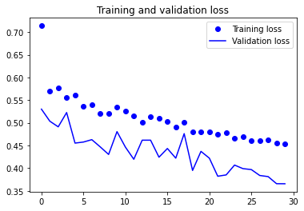

# Building a CNN from Scratch - Lab

## Introduction

Now that you have background knowledge regarding how CNNs work and how to build them using Keras, its time to practice those skills a little more independently in order to build a CNN on your own to solve a image recognition problem. In this lab, you'll practice building an image classifier from start to finish using a CNN.  

## Objectives

In this lab you will: 

- Load images from a hierarchical file structure using an image datagenerator 
- Apply data augmentation to image files before training a neural network 
- Build a CNN using Keras 
- Visualize and evaluate the performance of CNN models 

## Loading the Images

The data for this lab are a bunch of pictures of cats and dogs, and our task is to correctly classify a picture as one or the other. The [original dataset](https://www.kaggle.com/c/dogs-vs-cats) is from Kaggle. We have downsampled this dataset in order to reduce training time for you when you design and fit your model to the data. ⏰ It is anticipated that this process will take approximately one hour to run on a standard machine, although times will vary depending on your particular computer and set up. At the end of this lab, you are welcome to try training on the complete dataset and observe the impact on the model's overall accuracy. 

You can find the initial downsampled dataset in a subdirectory, **cats_dogs_downsampled**, of this repository. 


```python
# Load the images; be sure to also preprocess these into tensors 

train_dir = 'cats_dogs_downsampled/train'
validation_dir = 'cats_dogs_downsampled/val/'
test_dir = 'cats_dogs_downsampled/test/' 
```


```python
# __SOLUTION__ 
from keras.preprocessing.image import ImageDataGenerator
import datetime

original_start = datetime.datetime.now()
start = datetime.datetime.now()
```


```python
# __SOLUTION__ 
# All images will be rescaled by 1./255
train_datagen = ImageDataGenerator(rescale=1./255)
val_datagen = ImageDataGenerator(rescale=1./255)

train_generator = train_datagen.flow_from_directory(
        # This is the target directory
        train_dir,
        # All images will be resized to 150x150
        target_size=(150, 150),
        batch_size=20,
        # Since we use binary_crossentropy loss, we need binary labels
        class_mode='binary')

validation_generator = val_datagen.flow_from_directory(validation_dir,
                                                        target_size=(150, 150),
                                                        batch_size=20,
                                                        class_mode='binary')
```

    Found 2140 images belonging to 2 classes.
    Found 420 images belonging to 2 classes.


## Designing the Model

Now it's time to design your CNN using Keras! Remember a few things when doing this: 

- You should alternate convolutional and pooling layers
- You should have later layers have a larger number of parameters in order to detect more abstract patterns
- Add some final dense layers to add a classifier to the convolutional base 
- Compile this model 


```python
# Your code here; design and compile the model
```


```python
# __SOLUTION__ 
from keras import layers
from keras import models

model = models.Sequential()
model.add(layers.Conv2D(32, (3, 3), activation='relu',
                        input_shape=(150, 150, 3)))
model.add(layers.MaxPooling2D((2, 2)))
model.add(layers.Conv2D(64, (3, 3), activation='relu'))
model.add(layers.MaxPooling2D((2, 2)))
model.add(layers.Conv2D(128, (3, 3), activation='relu'))
model.add(layers.MaxPooling2D((2, 2)))
model.add(layers.Conv2D(128, (3, 3), activation='relu'))
model.add(layers.MaxPooling2D((2, 2)))
model.add(layers.Flatten())
model.add(layers.Dense(512, activation='relu'))
model.add(layers.Dense(1, activation='sigmoid'))
```


```python
# __SOLUTION__ 
from keras import optimizers

model.compile(loss='binary_crossentropy',
              optimizer=optimizers.RMSprop(lr=1e-4),
              metrics=['acc'])
```

## Training and Evaluating the Model

Remember that training deep networks is resource intensive: depending on the size of the data, even a CNN with 3-4 successive convolutional and pooling layers is apt to take a hours to train on a high end laptop. Using 30 epochs and 8 layers (alternating between convolutional and pooling), our model took about 40 minutes to run on a year old macbook pro.


If you are concerned with runtime, you may want to set your model to run the training epochs overnight.  

**If you are going to run this process overnight, be sure to also script code for the following questions concerning data augmentation. Check your code twice (or more) and then set the notebook to run all, or something equivalent to have them train overnight.** 


```python
# Set the model to train 
# ⏰ This cell may take several minutes to run 

```


```python
# Plot history
import matplotlib.pyplot as plt
%matplotlib inline

```


```python
# __SOLUTION__ 
# ⏰ This cell may take several minutes to run
history = model.fit(train_generator, 
                              steps_per_epoch=100, 
                              epochs=30, 
                              validation_data=validation_generator, 
                              validation_steps=20)
```

    Epoch 1/30
    100/100 [==============================] - 33s 332ms/step - loss: 0.6887 - acc: 0.5320 - val_loss: 0.6971 - val_acc: 0.5075
    Epoch 2/30
    100/100 [==============================] - 32s 324ms/step - loss: 0.6566 - acc: 0.6095 - val_loss: 0.6364 - val_acc: 0.6250
    Epoch 3/30
    100/100 [==============================] - 32s 324ms/step - loss: 0.6047 - acc: 0.6775 - val_loss: 0.7532 - val_acc: 0.5375
    Epoch 4/30
    100/100 [==============================] - 34s 338ms/step - loss: 0.5710 - acc: 0.7010 - val_loss: 0.5709 - val_acc: 0.6750
    Epoch 5/30
    100/100 [==============================] - 36s 363ms/step - loss: 0.5288 - acc: 0.7350 - val_loss: 0.5640 - val_acc: 0.7000
    Epoch 6/30
    100/100 [==============================] - 34s 344ms/step - loss: 0.5057 - acc: 0.7395 - val_loss: 0.5231 - val_acc: 0.7375
    Epoch 7/30
    100/100 [==============================] - 37s 369ms/step - loss: 0.4792 - acc: 0.7690 - val_loss: 0.5064 - val_acc: 0.7475
    Epoch 8/30
    100/100 [==============================] - 33s 334ms/step - loss: 0.4535 - acc: 0.7785 - val_loss: 0.5260 - val_acc: 0.7225
    Epoch 9/30
    100/100 [==============================] - 32s 324ms/step - loss: 0.4354 - acc: 0.8060 - val_loss: 0.4936 - val_acc: 0.7650
    Epoch 10/30
    100/100 [==============================] - 31s 312ms/step - loss: 0.4035 - acc: 0.8160 - val_loss: 0.4834 - val_acc: 0.7525
    Epoch 11/30
    100/100 [==============================] - 34s 336ms/step - loss: 0.3806 - acc: 0.8275 - val_loss: 0.5114 - val_acc: 0.7225
    Epoch 12/30
    100/100 [==============================] - 32s 320ms/step - loss: 0.3578 - acc: 0.8350 - val_loss: 0.4935 - val_acc: 0.7475
    Epoch 13/30
    100/100 [==============================] - 33s 332ms/step - loss: 0.3310 - acc: 0.8595 - val_loss: 0.5039 - val_acc: 0.7475
    Epoch 14/30
    100/100 [==============================] - 33s 327ms/step - loss: 0.3085 - acc: 0.8730 - val_loss: 0.5270 - val_acc: 0.7575
    Epoch 15/30
    100/100 [==============================] - 34s 338ms/step - loss: 0.2869 - acc: 0.8685 - val_loss: 0.5364 - val_acc: 0.7500
    Epoch 16/30
    100/100 [==============================] - 34s 343ms/step - loss: 0.2716 - acc: 0.8870 - val_loss: 0.5125 - val_acc: 0.7500
    Epoch 17/30
    100/100 [==============================] - 33s 327ms/step - loss: 0.2382 - acc: 0.9020 - val_loss: 0.5793 - val_acc: 0.7625
    Epoch 18/30
    100/100 [==============================] - 32s 324ms/step - loss: 0.2308 - acc: 0.9105 - val_loss: 0.5709 - val_acc: 0.7575
    Epoch 19/30
    100/100 [==============================] - 32s 321ms/step - loss: 0.2039 - acc: 0.9270 - val_loss: 0.5350 - val_acc: 0.7525
    Epoch 20/30
    100/100 [==============================] - 32s 323ms/step - loss: 0.1880 - acc: 0.9345 - val_loss: 0.5994 - val_acc: 0.7450
    Epoch 21/30
    100/100 [==============================] - 32s 318ms/step - loss: 0.1656 - acc: 0.9365 - val_loss: 0.6693 - val_acc: 0.7300
    Epoch 22/30
    100/100 [==============================] - 32s 321ms/step - loss: 0.1419 - acc: 0.9515 - val_loss: 0.6539 - val_acc: 0.7475
    Epoch 23/30
    100/100 [==============================] - 31s 311ms/step - loss: 0.1290 - acc: 0.9545 - val_loss: 0.6515 - val_acc: 0.7375
    Epoch 24/30
    100/100 [==============================] - 33s 328ms/step - loss: 0.1211 - acc: 0.9590 - val_loss: 0.6170 - val_acc: 0.7700
    Epoch 25/30
    100/100 [==============================] - 32s 316ms/step - loss: 0.1001 - acc: 0.9690 - val_loss: 0.7030 - val_acc: 0.7300
    Epoch 26/30
    100/100 [==============================] - 31s 315ms/step - loss: 0.0864 - acc: 0.9765 - val_loss: 0.7112 - val_acc: 0.7575
    Epoch 27/30
    100/100 [==============================] - 32s 317ms/step - loss: 0.0729 - acc: 0.9795 - val_loss: 0.8144 - val_acc: 0.7375
    Epoch 28/30
    100/100 [==============================] - 32s 317ms/step - loss: 0.0705 - acc: 0.9755 - val_loss: 0.7445 - val_acc: 0.7500
    Epoch 29/30
    100/100 [==============================] - 32s 315ms/step - loss: 0.0592 - acc: 0.9830 - val_loss: 0.7779 - val_acc: 0.7525
    Epoch 30/30
    100/100 [==============================] - 32s 316ms/step - loss: 0.0415 - acc: 0.9890 - val_loss: 1.0948 - val_acc: 0.7350


```python
# __SOLUTION__ 
import matplotlib.pyplot as plt
%matplotlib inline 

acc = history.history['acc']
val_acc = history.history['val_acc']
loss = history.history['loss']
val_loss = history.history['val_loss']
epochs = range(len(acc))
plt.plot(epochs, acc, 'bo', label='Training acc')
plt.plot(epochs, val_acc, 'b', label='Validation acc')
plt.title('Training and validation accuracy')
plt.legend()
plt.figure()
plt.plot(epochs, loss, 'bo', label='Training loss')
plt.plot(epochs, val_loss, 'b', label='Validation loss')
plt.title('Training and validation loss')
plt.legend()
plt.show()
```


```python
# __SOLUTION__ 
end = datetime.datetime.now()
elapsed = end - start
print('Training took a total of {}'.format(elapsed))
```

    Training took a total of 0:16:35.989245


## Save the Model


```python
# Your code here; save the model for future reference 
```


```python
# __SOLUTION__ 
model.save('cats_dogs_downsampled_data.h5')
```

## Data Augmentation

Recall that data augmentation is typically always a necessary step when using a small dataset as this one which you have been provided. As such, if you haven't already, implement a data augmentation setup.

**Warning: ⏰ This process took nearly 4 hours to run on a relatively new macbook pro. As such, it is recommended that you simply code the setup and compare to the solution branch, or set the process to run overnight if you do choose to actually run the code.** 


```python
# Add data augmentation to the model setup and set the model to train; 
# See warnings above if you intend to run this block of code 
# ⏰ This cell may take several hours to run 

```


```python
# __SOLUTION__ 
start = datetime.datetime.now()
```


```python
# __SOLUTION__ 
train_datagen = ImageDataGenerator(rescale=1./255,
                                   rotation_range=40, 
                                   width_shift_range=0.2, 
                                   height_shift_range=0.2, 
                                   shear_range=0.2, 
                                   zoom_range=0.2, 
                                   horizontal_flip=True, 
                                   fill_mode='nearest')

train_generator = train_datagen.flow_from_directory(
        # This is the target directory
        train_dir,
        # All images will be resized to 150x150
        target_size=(150, 150),
        batch_size=20,
        # Since we use binary_crossentropy loss, we need binary labels
        class_mode='binary')

history = model.fit(train_generator, 
                              steps_per_epoch=100, 
                              epochs=30, 
                              validation_data=validation_generator, 
                              validation_steps=20)
```

    Found 2140 images belonging to 2 classes.
    Epoch 1/30
    100/100 [==============================] - 33s 334ms/step - loss: 0.7139 - acc: 0.6745 - val_loss: 0.5301 - val_acc: 0.7375
    Epoch 2/30
    100/100 [==============================] - 32s 322ms/step - loss: 0.5696 - acc: 0.7020 - val_loss: 0.5035 - val_acc: 0.7450
    Epoch 3/30
    100/100 [==============================] - 33s 327ms/step - loss: 0.5776 - acc: 0.6985 - val_loss: 0.4911 - val_acc: 0.7600
    Epoch 4/30
    100/100 [==============================] - 34s 338ms/step - loss: 0.5562 - acc: 0.7090 - val_loss: 0.5226 - val_acc: 0.7475
    Epoch 5/30
    100/100 [==============================] - 33s 326ms/step - loss: 0.5603 - acc: 0.7165 - val_loss: 0.4552 - val_acc: 0.7850
    Epoch 6/30
    100/100 [==============================] - 32s 325ms/step - loss: 0.5361 - acc: 0.7210 - val_loss: 0.4576 - val_acc: 0.7850
    Epoch 7/30
    100/100 [==============================] - 33s 326ms/step - loss: 0.5393 - acc: 0.7345 - val_loss: 0.4628 - val_acc: 0.7775
    Epoch 8/30
    100/100 [==============================] - 34s 338ms/step - loss: 0.5208 - acc: 0.7185 - val_loss: 0.4469 - val_acc: 0.7750
    Epoch 9/30
    100/100 [==============================] - 35s 349ms/step - loss: 0.5210 - acc: 0.7340 - val_loss: 0.4302 - val_acc: 0.8075
    Epoch 10/30
    100/100 [==============================] - 35s 350ms/step - loss: 0.5347 - acc: 0.7145 - val_loss: 0.4805 - val_acc: 0.7350
    Epoch 11/30
    100/100 [==============================] - 34s 345ms/step - loss: 0.5258 - acc: 0.7290 - val_loss: 0.4464 - val_acc: 0.7900
    Epoch 12/30
    100/100 [==============================] - 36s 359ms/step - loss: 0.5149 - acc: 0.7395 - val_loss: 0.4196 - val_acc: 0.8075
    Epoch 13/30
    100/100 [==============================] - 36s 356ms/step - loss: 0.5013 - acc: 0.7475 - val_loss: 0.4617 - val_acc: 0.7825
    Epoch 14/30
    100/100 [==============================] - 34s 343ms/step - loss: 0.5133 - acc: 0.7385 - val_loss: 0.4617 - val_acc: 0.7775
    Epoch 15/30
    100/100 [==============================] - 34s 337ms/step - loss: 0.5107 - acc: 0.7435 - val_loss: 0.4241 - val_acc: 0.7975
    Epoch 16/30
    100/100 [==============================] - 38s 377ms/step - loss: 0.5037 - acc: 0.7540 - val_loss: 0.4433 - val_acc: 0.7700
    Epoch 17/30
    100/100 [==============================] - 35s 353ms/step - loss: 0.4900 - acc: 0.7555 - val_loss: 0.4220 - val_acc: 0.7875
    Epoch 18/30
    100/100 [==============================] - 38s 376ms/step - loss: 0.5009 - acc: 0.7495 - val_loss: 0.4761 - val_acc: 0.7650
    Epoch 19/30
    100/100 [==============================] - 34s 340ms/step - loss: 0.4804 - acc: 0.7665 - val_loss: 0.3949 - val_acc: 0.8175
    Epoch 20/30
    100/100 [==============================] - 34s 339ms/step - loss: 0.4808 - acc: 0.7640 - val_loss: 0.4370 - val_acc: 0.8025
    Epoch 21/30
    100/100 [==============================] - 37s 370ms/step - loss: 0.4801 - acc: 0.7800 - val_loss: 0.4220 - val_acc: 0.8225
    Epoch 22/30
    100/100 [==============================] - 35s 346ms/step - loss: 0.4751 - acc: 0.7720 - val_loss: 0.3822 - val_acc: 0.8175
    Epoch 23/30
    100/100 [==============================] - 35s 355ms/step - loss: 0.4788 - acc: 0.7735 - val_loss: 0.3851 - val_acc: 0.8100
    Epoch 24/30
    100/100 [==============================] - 34s 343ms/step - loss: 0.4656 - acc: 0.7745 - val_loss: 0.4068 - val_acc: 0.8125
    Epoch 25/30
    100/100 [==============================] - 34s 335ms/step - loss: 0.4701 - acc: 0.7840 - val_loss: 0.3989 - val_acc: 0.8200
    Epoch 26/30
    100/100 [==============================] - 34s 338ms/step - loss: 0.4609 - acc: 0.7800 - val_loss: 0.3969 - val_acc: 0.8175
    Epoch 27/30
    100/100 [==============================] - 34s 345ms/step - loss: 0.4613 - acc: 0.7815 - val_loss: 0.3838 - val_acc: 0.8350
    Epoch 28/30
    100/100 [==============================] - 34s 337ms/step - loss: 0.4617 - acc: 0.7740 - val_loss: 0.3814 - val_acc: 0.8325
    Epoch 29/30
    100/100 [==============================] - 33s 333ms/step - loss: 0.4559 - acc: 0.7855 - val_loss: 0.3657 - val_acc: 0.8200
    Epoch 30/30
    100/100 [==============================] - 33s 334ms/step - loss: 0.4532 - acc: 0.7870 - val_loss: 0.3656 - val_acc: 0.8500


```python
# __SOLUTION__ 
acc = history.history['acc']
val_acc = history.history['val_acc']
loss = history.history['loss']
val_loss = history.history['val_loss']
epochs = range(len(acc))
plt.plot(epochs, acc, 'bo', label='Training acc')
plt.plot(epochs, val_acc, 'b', label='Validation acc')
plt.title('Training and validation accuracy')
plt.legend()
plt.figure()
plt.plot(epochs, loss, 'bo', label='Training loss')
plt.plot(epochs, val_loss, 'b', label='Validation loss')
plt.title('Training and validation loss')
plt.legend()
plt.show()
```





```python
# __SOLUTION__ 
end = datetime.datetime.now()
elapsed = end - start
print('Training with data augmentation took a total of {}'.format(elapsed))
```

    Training with data augmentation took a total of 0:17:24.572420


Save the model for future reference.  


```python
# Save the model 

```


```python
# __SOLUTION__ 
model.save('cats_dogs_downsampled_with_augmentation_data.h5')
```

## Final Evaluation

Now use the test set to perform a final evaluation on your model of choice. 


```python
# Your code here 
# Perform a final evaluation using the test set
```


```python
# __SOLUTION__ 
test_datagen = ImageDataGenerator(rescale=1./255)

test_generator = test_datagen.flow_from_directory(test_dir, 
                                                  target_size=(150, 150), 
                                                  batch_size=20, 
                                                  class_mode='binary')
test_loss, test_acc = model.evaluate(test_generator, steps=20)
print('test acc:', test_acc)
```

    Found 425 images belonging to 2 classes.
    20/20 [==============================] - 2s 86ms/step - loss: 0.4640 - acc: 0.7650
    test acc: 0.7649999856948853


## Summary

Well done! In this lab, you practice building your own CNN for image recognition which drastically outperformed our previous attempts using a standard deep learning model alone. In the upcoming sections, we'll continue to investigate further techniques associated with CNNs including visualizing the representations they learn and techniques to further bolster their performance when we have limited training data such as here.
